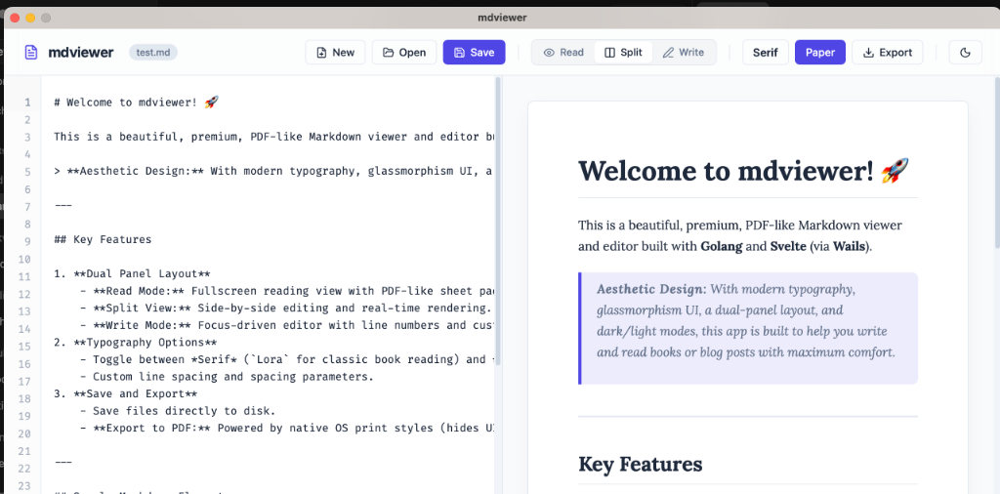

# 🚀 mdviewer (mdview)

A beautiful, premium Markdown viewer and editor built with **Golang** and **Svelte** (via **Wails**). Designed for comfort, speed, and high-quality document exporting, making it the perfect tool for writing books, blogs, and technical documentation.



---

## ✨ Features

- **📖 PDF-Like Reader Mode:** Beautiful fullscreen layout using traditional print margins, shadow card container, and warm paper style.
- **⚡ Real-Time Split View:** Double panel split mode coordinating the editor on the left and live preview rendering on the right.
- **✍️ Focus-Driven Writer Mode:** Clean markdown editor with monospaced line numbers and customized 4-space Tab key indentation.
- **🎨 Dark & Light Themes:** Instant, smooth transitioning between dark mode and warm paper light mode.
- **🔤 Custom Typography:** Toggle between serif (`Lora` for classic book reading) and sans-serif (`Inter` for technical posts).
- **📊 Doc Statistics:** Live word and character count tracking in the bottom status bar.
- **📄 Perfect A4 PDF Export:** Generates high-fidelity PDF documents using custom off-screen page-slicing logic (strictly respects table boundaries, code blocks, and blockquotes—preventing cut-off lines).
- **📦 Global Installer:** Unix/macOS/Linux shell installer (`install.sh`) and Windows PowerShell installer (`install.ps1`) to automatically configure the global CLI command `mdview`.

---

## 🚀 How to Run & Install

### Development
Start the application in development mode with hot-reloading:
```bash
./run test.md
```

### Build for all OS
Compile binaries for macOS, Windows, and Linux:
```bash
./build_all
```

### Install Globally (Create CLI)
To use `mdview <filename.md>` globally in your terminal:
- **macOS / Linux:** Run `./install.sh`
- **Windows:** Run `.\install.ps1` in PowerShell
